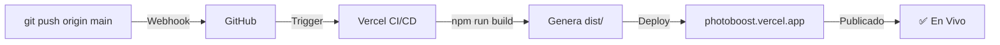

# 📋 Guía de Despliegue - PhotoBoost

## 🔍 Diagnóstico de Sincronización GitHub ↔ Vercel

### ✅ Problemas Solucionados (30-10-2025)

1. **vercel.json vacío** → Ahora contiene configuración completa de build
2. **Build automático no funcionaba** → Vercel ahora ejecutará `npm run build` automáticamente
3. **Hash de archivos desactualizado** → Vercel regenerará los assets correctamente

### 📊 Verificación Actual

```bash
# Estado del repositorio
git status                    # ✅ Clean
git log --oneline -5         # ✅ Commits visible
git remote -v                # ✅ GitHub conectado
npm run build                # ✅ Build exitoso

# Archivos críticos
vercel.json                  # ✅ Configurado correctamente
package.json                 # ✅ Scripts de build correctos
vite.config.js              # ✅ Config de Vite OK
.gitignore                  # ✅ dist/ ignorado (correcto)
```

## 🚀 Flujo de Despliegue Automático



## 📝 Checklist Antes de Cada Push

- [ ] `git status` - Working tree clean
- [ ] Cambios locales commiteados
- [ ] `npm run build` - Sin errores
- [ ] `npm run lint` (si aplica)
- [ ] `git push origin main`
- [ ] Vercel comienza a desplegar (verificar en console.vercel.com)

## 🔧 Configuración de Vercel

### `vercel.json` Estructura

```json
{
  "version": 2,
  "buildCommand": "npm run build",      // Ejecuta Vite build
  "outputDirectory": "dist",             // Carpeta a servir
  "devCommand": "npm run dev",           // Desarrollo local
  "functions": {
    "api/**/*.js": {                     // Serverless Functions
      "runtime": "nodejs20.x",
      "memory": 1024,
      "maxDuration": 30
    }
  }
}
```

## 🛠️ Troubleshooting

### Vercel no se actualiza después de push
**Solución:**
1. Ir a https://console.vercel.com
2. Seleccionar proyecto "photoboost"
3. Ir a Settings → Git
4. Verificar que "main" branch esté conectado
5. Click en "Redeploy" manualmente si es necesario

### Build falla en Vercel pero funciona localmente
**Causa común:** Variables de entorno no configuradas
```bash
# En console.vercel.com:
# Settings → Environment Variables
# Agregar todas las variables que usa la app:
AIRTABLE_API_KEY
AIRTABLE_BASE_ID
GOOGLE_AI_API_KEY
```

### Los cambios se ven en dev pero no en producción
**Solución:**
1. Limpiar caché de Vercel: `npm run build && rm -rf dist`
2. Force push: `git push --force origin main` (⚠️ Usar con cuidado)
3. O redeploy desde console

## 📱 URLs Importantes

- **Aplicación:** https://photoboost.vercel.app
- **Dashboard Vercel:** https://console.vercel.com/jmacias95/photoboost
- **GitHub Repo:** https://github.com/JustoSole/photoboost
- **API Docs:** https://photoboost.vercel.app/api/hello (test)

## 📌 Próximos Pasos

- [ ] Verificar que Vercel completó el deployment
- [ ] Visitar https://photoboost.vercel.app
- [ ] Comprobar que cambios son visibles
- [ ] Revisar logs en Vercel console si hay problemas

---
*Última actualización: 2025-10-30*
